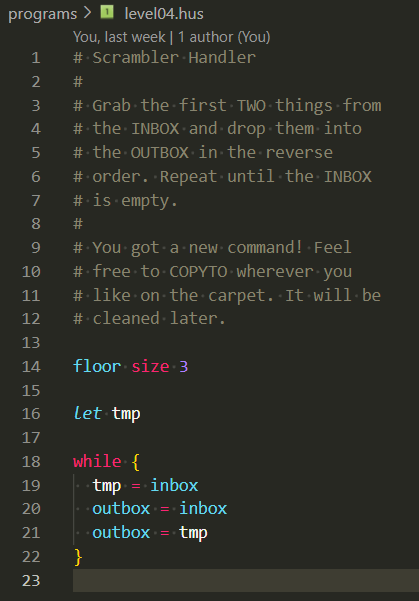
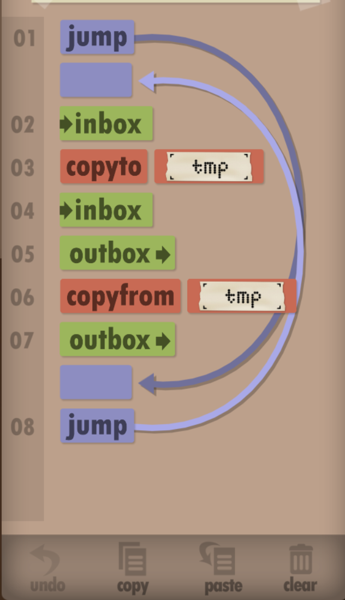

# Humanscript

High level programming language for the game [Human Resource Machine](https://store.steampowered.com/app/375820/Human_Resource_Machine/).

Need a new way to play the game? Try writing programs with `humanscript`, and then compiling them into in-game code
(`hassembly`) with this project. Just copy the compiled code to your clipboard and use the
in-game "paste" button :tada:.

| Humanscript (write code) | Hassembly (compile and copy) | Game (paste and run) |
| --- | --- | --- |
|  |  | |

**note**: This project was built for linux and may not work on windows (try [wsl](https://en.wikipedia.org/wiki/Windows_Subsystem_for_Linux) instead!)

## VSCode Syntax Highlighting and Language Support

Do you like pretty colors? Do you use VSCode? If so, then run the following command to install a local vscode extension
that provides language support for `humanscript` (the high level code), and `hassembly` (the compiled game code). Run
the `Developer: Reload Window` command from the command palette and VSCode should automatically apply your theme to
`.hus` and `.husc` files.

This also adds comment support for the `ctrl + /` shortcut, and it adds icons for `.hus` and `.husc` files.

```sh
npm run -w syntax-highlighting/ update
```

## Terminal Setup

Installs the expected version of node via `nvm` and installs dependencies.

```sh
. ./setup
```

## Compiling Quick Start

Create a file named `example.hus` with the following code

```hus
outbox = inbox
```

Then run

```sh
npm run compile example.hus
```

This should output an `example.husc` file whose contents can be copy and pasted into the game.

## Compiling

**note**: The humanscript parser is written with [parsimmon](https://github.com/jneen/parsimmon/blob/master/API.md), and relies on
parsimmon's default behavior for reporting syntax errors.

```sh
# See the programs/ directory for example programs
npm run compile <program-filepath>

# Compile all programs in the programs/ directory
npm run compile -- --levels
```

## Language Features

Feature documentation follows the same order of unlocked `hassembly` commands.

### Inbox and Outbox Management

Level 1 provides the most basic commands: `INBOX` and `OUTBOX`. In `humanscript`, `outbox` is a writeable reference, and
`inbox` is a readable reference, so you can compose them into a basic assignment statement.

**note**: references to `inbox` mutate the input stream. Starting from level 4 you can assign `inbox` to a variable to
persist the next input value between statements.

```hus
outbox = inbox
```

### Infinite While Loops

Level 2 introduces the `JUMP` command. This is utilized in `humanscript` to create infinite loops via a conditionless
while statement. The curly braces denote the block of code (the list of statements) to be run continuously.

```hus
while {
 # more code goes here
}
```

### Variables, and Memory Management

At level 3 you will gain access to the floor which serves as memory.

#### Floor Initialization

In order to create variables and perform certain
operations, the compiler must know how much floor space is available. You can accomplish this with a floor
initialization statement.

```hus
floor size 10
```

#### Declaring and Using Variables

Use the `let` keyword to declare variables. Each variable must have its own `let`.

**note**: In it's current state, the compiler only supports variables whose name contains lowercase letters and numbers,
and variables cannot start with a number

```hus
let next
```

Variables are readable and writeable!

```hus
next = inbox
outbox = next
```

#### Specifying Floor Indicies

To make a variable point to a specific floor tile you can use the `at` keyword. This is useful when the game preloads
tiles with data. For example on level 3, if you want to output the "x" in floor slot two you can do:

```hus
floor size 6

let ref at 2

outbox = ref
```

#### Floor Labels

Floor labels are technically unlocked on level 20, but apparently the game doesn't care if you paste code that has floor
labels. The compiler will turn your variable names into pixelated floor labels!


The compiler treats floor labels as a 32 by 10 pixel space. [imageUtils.ts](./src/utils/imageUtils.ts) contains pixel data for some characters
such as the lowercase alphabet. Because the pixel space is so limited you'll receive a compiler warning that your variable
label was truncated if it's too long (don't worry, your code will still run!).

You can also define a shorter label for variables with the `labeled` keyword.

```hus
let supercalifragilisticexpialidocious labeled smol

supercalifragilisticexpialidocious = inbox
outbox = supercalifragilisticexpialidocious
```


### Addition

Level 6 adds the `ADD` command which means you can now use addition! A math expression must always be part of an
assignment statement. Notice that the left part of the assignment can be writeable reference such as a variable or
`outbox`

```hus
let value1
let value2
let value3

value3 = value1 + value2
```

### Registers

You might have noticed when using the `+` operator that the compiler generated a special `$acc` variable. This is one of
four registers that the compiler can dynamically allocate based on your code. In the game, the character's hands act as
a register, but the compiler cannot rely on this (see [Limitations](#limitations) to understand why). The accumulator
(`$acc`) allows the compiled program to store information, such as the sum of two numbers, before doing other operations
with that information, such as saving a sum to another variable.

If you create too many variables you might run out of floor space and receive an error when the compiler tries to
allocate a register.

The four registers are as follows

- accumulator (`$acc`): saves the result of an operation such as basic math, or a logical comparison
- iterator (`$iter`): tracks addition iterations during multiplication
- quotient (`$quot`): accumulates the result of division (rounded down). During the division the accumulator is used for
  substeps of the division process
- remainder (`$rem`): stores the remainder of division

**note**: you cannot (and should not) reference a register in your code (eg. assigning to `$acc`)

### If and While Statements With Basic Zero Equality Comparisons

Level 7 brings about `JUMPZ` which enables access to basic logical comparisons between a readable reference and `0`.
These comparisons can be used as conditions for `if` statements and `while` statements. `if` statements can also provide
an optional `else` statement with its own block for when the condition fails.

**note**:

- Conditions are only optional for `while` statements; not `if` statements
- In it's current state, `humanscript` does not support `else if` statements
- You cannot compare two readable references until you gain access to subtraction in level 11
- You cannot use less than or greater than comparisons until level 14 when you unlock `JUMPN`

```hus
let value

if (value == 0) {
  # runs if value is zero
}

if (value != 0) {
  # runs if value is not zero
}

if (value == 0) {
  # runs if value is zero
} else {
  # runs if value is not zero
}

while (value != 0) {
  # runs until value is zero
}
```

<!--
op      zero       ref
==      JZ /       SUB / JZ /
>       JZ / JN    SUB /    / JN
>=         / JN    SUB / JZ / JN
<          / JN    SUB /    / JN
<=      JZ / JN    SUB / JZ / JN
!=      JZ /       SUB / JZ

-->

## Limitations

The compiler's functionality, and thus the `humanscript` language, is limited by the in-game language. Consider playing
the game normally first to understand the limitations of the in-game language.

### Literals

In most programming languages you can define a literal such as `var num = 5` or `var letter = 'a'`, but there isn't a reliable way to
create numbers out of thin air in Human Resource Machine. Instead, the game provides literals for you in certain levels,
and you can create variables that reference those floor slots.

The only exceptions are:

- `0` can be used in the right hand side of a logical comparison since it leverages the `JUMPZ` hassembly command
- `1` can be used in increment and decrement assignment statements since they leverage the `BUMPUP` and `BUMPDN`
  hassembly commands

### Optimization

Compiled code is not optimized and is not intended to be optimized since it overcomplicates the compiler. To achieve
separation of concerns, compiled statements cannot know the value left in the in-game character's hands after the
previous statement. Therefore, extra floor slots are needed for registers to persist data, and extra code is needed to
read these registers or to re-read a value that may have just been written to.
